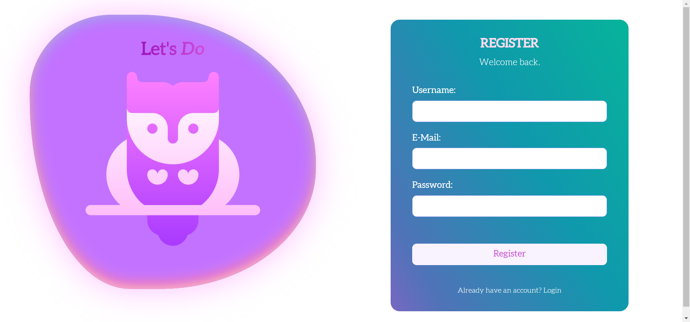
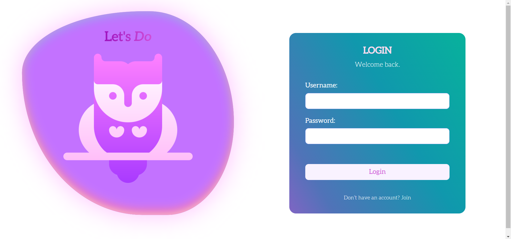
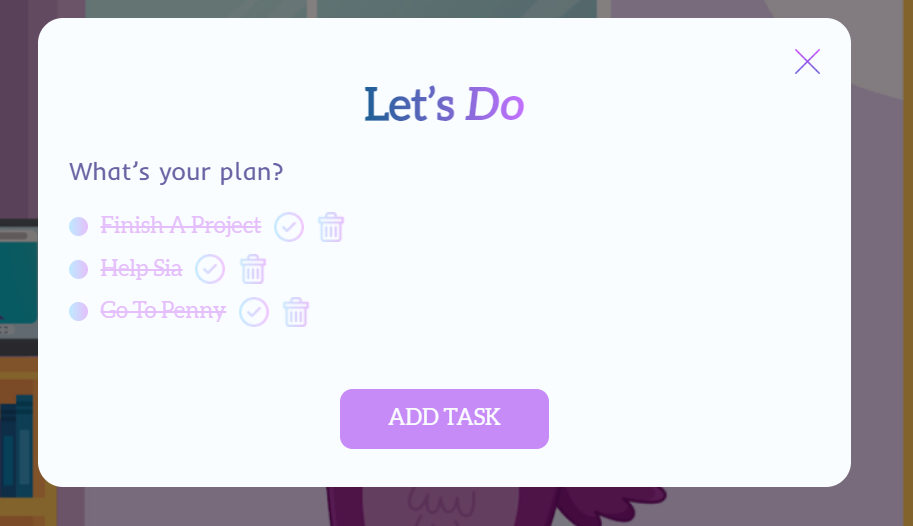
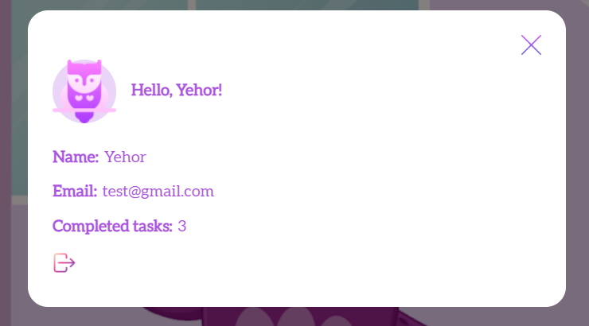

# LET'S DO

## About

---

Let's Do is a fun and intuitive ToDo application featuring our friendly owl mascot. Stay organized and on top of your tasks with ease. With Let's Do, you can easily manage your to-do list and track your progress. Get productive and have fun doing it with Let's Do!

<br />

## Project photos

---

### **_REGISTRATION PAGE_**



### **_LOGIN PAGE_**



### **_MAIN PAGE_**


### **_ADD TASK UI_**



### **_PROFILE UI_**



<br />

## Functionality description

---

1. It's possible to login users.
2. It's possible to register created before users.
3. Validation works well both on front-end and back-end sides.
4. It's possible to add tasks.
5. It's possible to perform tasks.
6. It's possible to delete tasks.
7. It's possible to logout from system.
8. It's possible to monitor changes in database.

<br />

## Pages description

---

- **REGISTRATION**: page, where you can register new user.
  ```console
  http://localhost:8080/login
  ```
- **LOGIN**: page, where you can login created user
  ```console
  http://localhost:8080/registration
  ```
- **MAIN**: page, where you can feel main functionality
  ```console
  http://localhost:8080/main.html
  ```

<br />

## Technologies stack

- _HTML5_
- _Sass/Scss_
- _JavaScript_
- _Webpack_
- _Node.js_
- _NPM_
- _Express.js_
- _BCRYPT_
- _JWT_
- _MongoDB_
- _MongoDB Compass_
- _MongoDB Atlas_
- _ESLint_
- _Prettier_
- _GIT_
- _GitLab_

<br />

## Project Launch Rules

---

1. Clone project on the local machine:

   ```bash
   git clone <repository-name>
   ```

2. Make sure that you are on the "first-version" branch

3. Go to the project folder:

   ```console
   cd lets-do
   ```

4. Install necessary dependencies being in the root directory:

   ```console
   npm i
   ```

5. Install necessary dependencies being in the "server" folder:

   ```console
   npm i
   ```

6. Make sure that you are in the root folder and run webpack server:

   ```console
   npm start
   ```

7. Go to the "server" directory and run backend server:

   ```console
   npm run dev
   ```

8. The website should run correctly in a browser

<br />

## Branches description

---

- **MAIN**: the main project branch in which the final project version will be located.
- **GH-PAGES**: the project branch in which the build version is located.
- **FIRST-VERSION**: the project branch with ready MVP (while the latest project version).

<br />

## NPM commands description

1. **_Webpack_** server

- **START**: run project in development mode, aautomatically launch webpack server, make changes just changing and saving files.
- **DEV**: run project in development mode and make a development bundle.
- **PROD**: run project in production mode and make a production bundle.
- **WATCH**: allow to save changes automatically by saving files.
- **CLEAR**: delete "dist" folder.
- **LINT**: make sure that the project without eslint and prettier errors.

2. **_Backend_** server

- **DEV**: run backend server.

<br />

## Authors:

---

- Yehor Potebenko <Yehor.Potebenko@Student.Reutlingen-University.DE>
- Anastasiia But <Anastasiia.But@Student.Reutlingen-University.DE>

<br />

## Enjoy our project!
